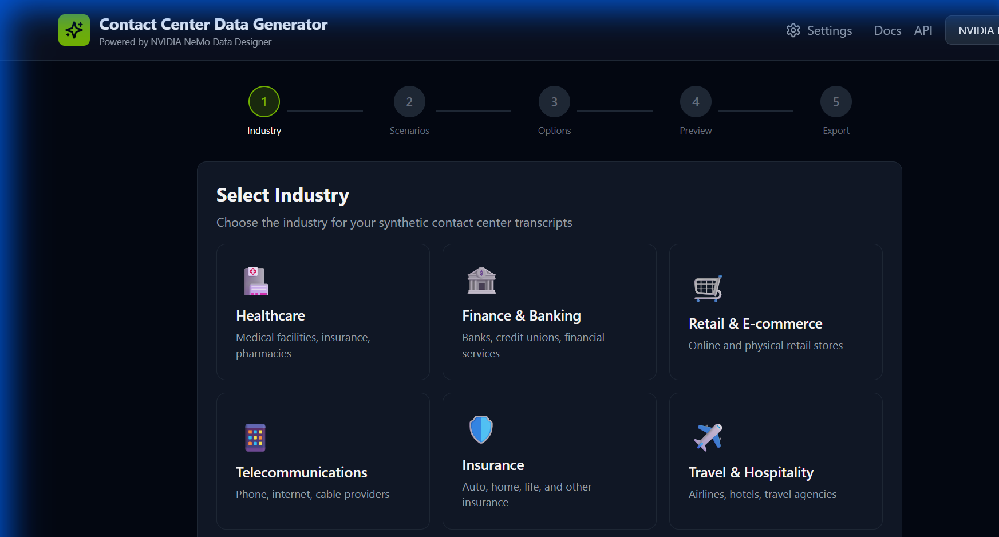
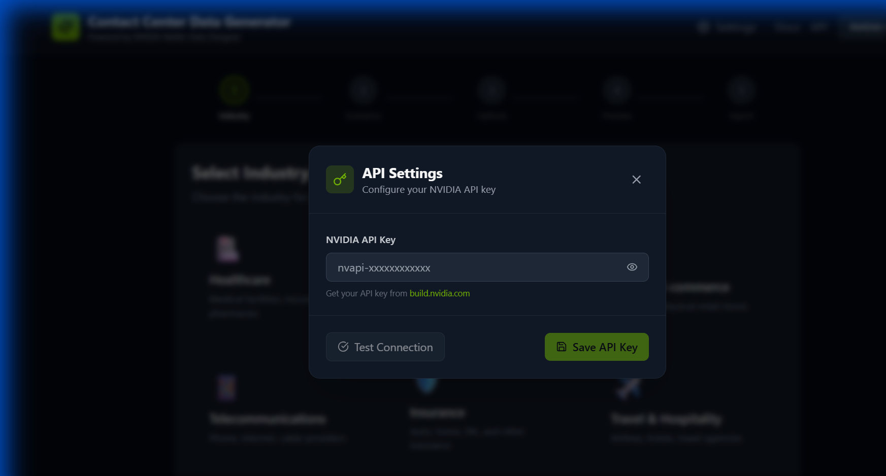
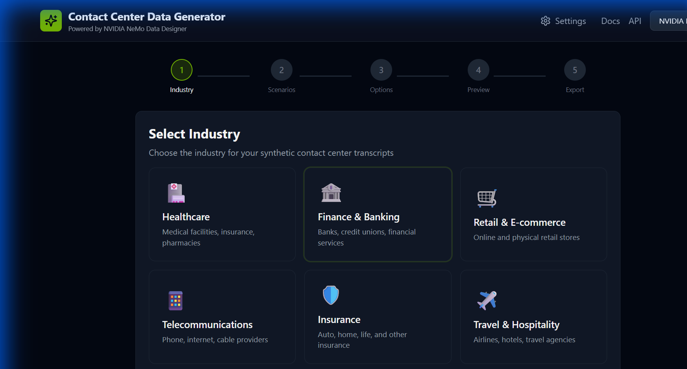
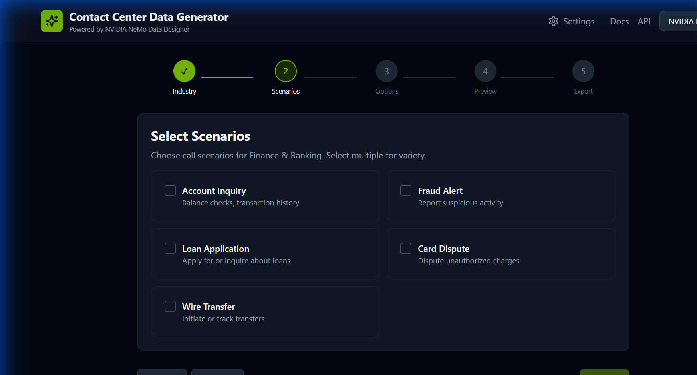
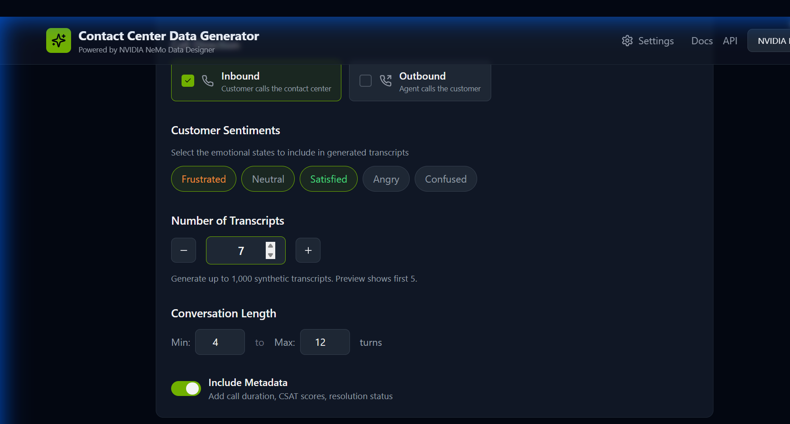
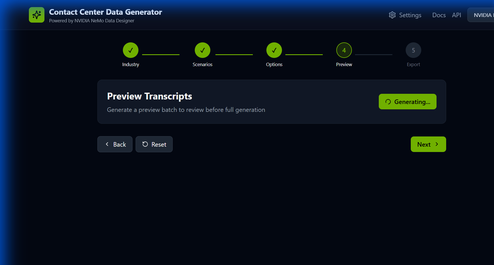
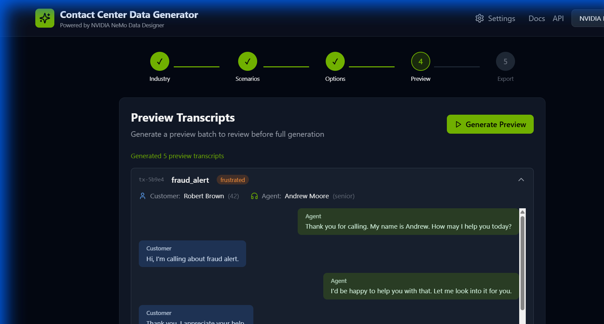
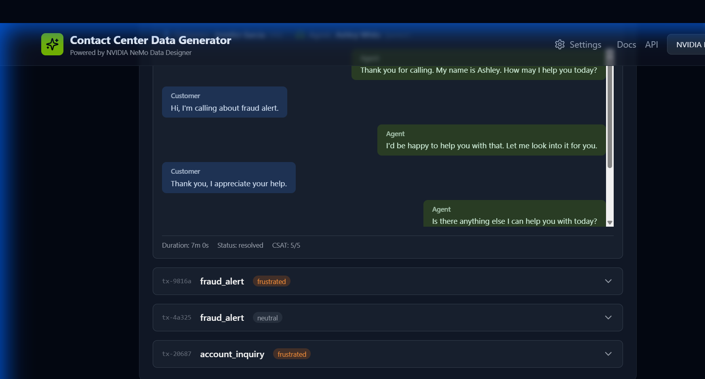

# Contact Center Transcript Generator - Demo

This document provides a step-by-step walkthrough of the **Contact Center Transcript Generator** application, demonstrating its complete workflow for generating synthetic contact center transcripts.

## Application Overview

The Contact Center Transcript Generator is a full-stack application that uses NeMo Data Designer to create realistic synthetic transcripts for contact center AI training. It features a wizard-style interface that guides users through the generation process.

---

## Step 1: Homepage

Upon launching the application, you'll see the homepage with the industry selection wizard.



**Features visible:**
- Clean, modern UI with step-by-step wizard
- Industry selection grid with multiple options
- Navigation steps: Industry → Scenarios → Options → Preview → Export

---

## Step 2: API Settings

Click the gear icon in the header to access API settings.



**Configuration Options:**
- NVIDIA API Key input for NeMo Data Designer integration
- Secure key storage with visibility toggle
- Save and cancel actions

---

## Step 3: Main Page Configuration

After closing settings, the main page shows the industry selection interface.


**Available Industries:**
- Telecommunications
- Finance & Banking
- Healthcare
- Retail & E-commerce
- Insurance
- Technology
- Travel & Hospitality

---

## Step 4: Industry Selection

Select an industry to configure your transcript generation. Here we selected **Finance & Banking**.



**What happens:**
- The selected industry is highlighted in green
- The "Next" button becomes active
- Industry-specific scenarios will be available in the next step

---

## Step 5: Scenario Selection

Choose the specific scenarios for transcript generation.



**Available Scenarios for Finance & Banking:**
- Account Inquiry
- Fraud Alert
- Loan Application
- Payment Issues
- Card Services
- Investment Advice
- And more...

Select one or more scenarios that match your training data needs.

---

## Step 6: Generation Options

Configure the generation parameters.



**Configurable Options:**
- **Call Direction**: Inbound, Outbound, or Both
- **Customer Sentiments**: Positive, Neutral, Negative, or Mix
- **Number of Transcripts**: 1-100 (set to 7 in this example)
- **Conversation Length**: Min and Max turns
- **Include Metadata**: Toggle for additional conversation metadata

---

## Step 7: Generating Preview

Click "Generate Preview" to start the AI-powered transcript generation.



**What's happening:**
- The application sends a request to the backend
- NeMo Data Designer AI generates realistic conversations
- Progress indicator shows "Generating Preview..."

---

## Step 8: Preview Results

View the generated transcripts before finalizing.



**Preview Features:**
- List of generated transcript IDs
- Expandable transcript cards
- Sentiment and turn count indicators
- Regenerate option for individual transcripts

---

## Step 9: Transcript Detail View

Click on a transcript to view the full conversation.



**Transcript Details:**
- Full conversation between Agent and Customer
- Realistic dialogue with industry-specific terminology
- Natural conversation flow and context
- Customer sentiment indicators

---

## Application Architecture

### Backend (FastAPI)
- **Port**: 8000
- **Endpoints**: `/api/v1/generate`, `/api/v1/jobs`, `/api/v1/industries`, `/api/v1/settings`
- **Services**: TranscriptGenerator using NeMo Data Designer

### Frontend (React + Vite)
- **Port**: 5173
- **Tech Stack**: React 18, TypeScript, Tailwind CSS, React Query, Zustand
- **Features**: Step wizard, real-time preview, export options

---

## Running the Application

### Prerequisites
- Python 3.10+
- Node.js 18+
- NVIDIA API Key

### Start Backend
```bash
cd backend
uvicorn app.main:app --reload --port 8000
```

### Start Frontend
```bash
cd frontend
npm install
npm run dev
```

### Access Application
Open [http://localhost:5173](http://localhost:5173) in your browser.

---

## Key Features Summary

| Feature | Description |
|---------|-------------|
| 🏭 **Multi-Industry Support** | 7+ industries with specific scenarios |
| 🎭 **Sentiment Control** | Generate transcripts with varying customer moods |
| 📊 **Configurable Length** | Control conversation turn counts |
| 👁️ **Live Preview** | Review transcripts before export |
| 📁 **Export Options** | Download in multiple formats |
| 🔐 **Secure API** | Encrypted API key storage |

---

*Generated on: December 10, 2025*
