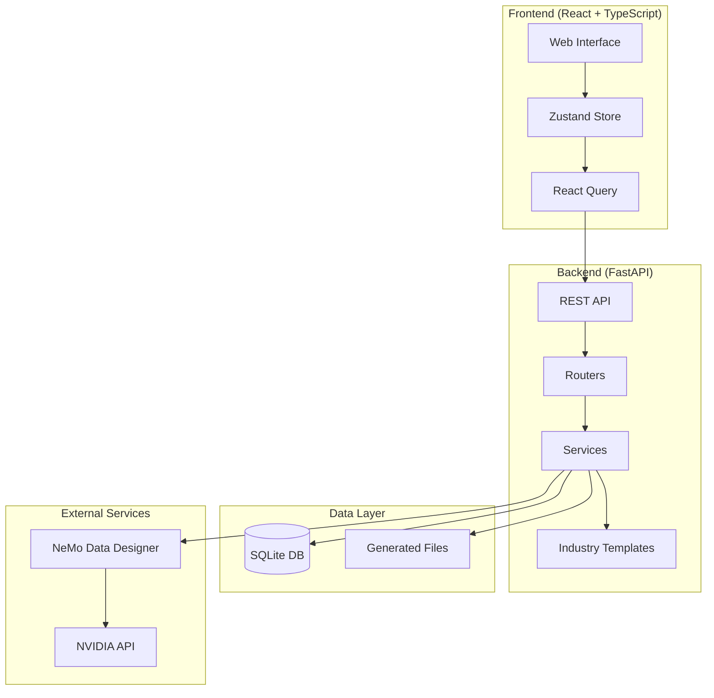
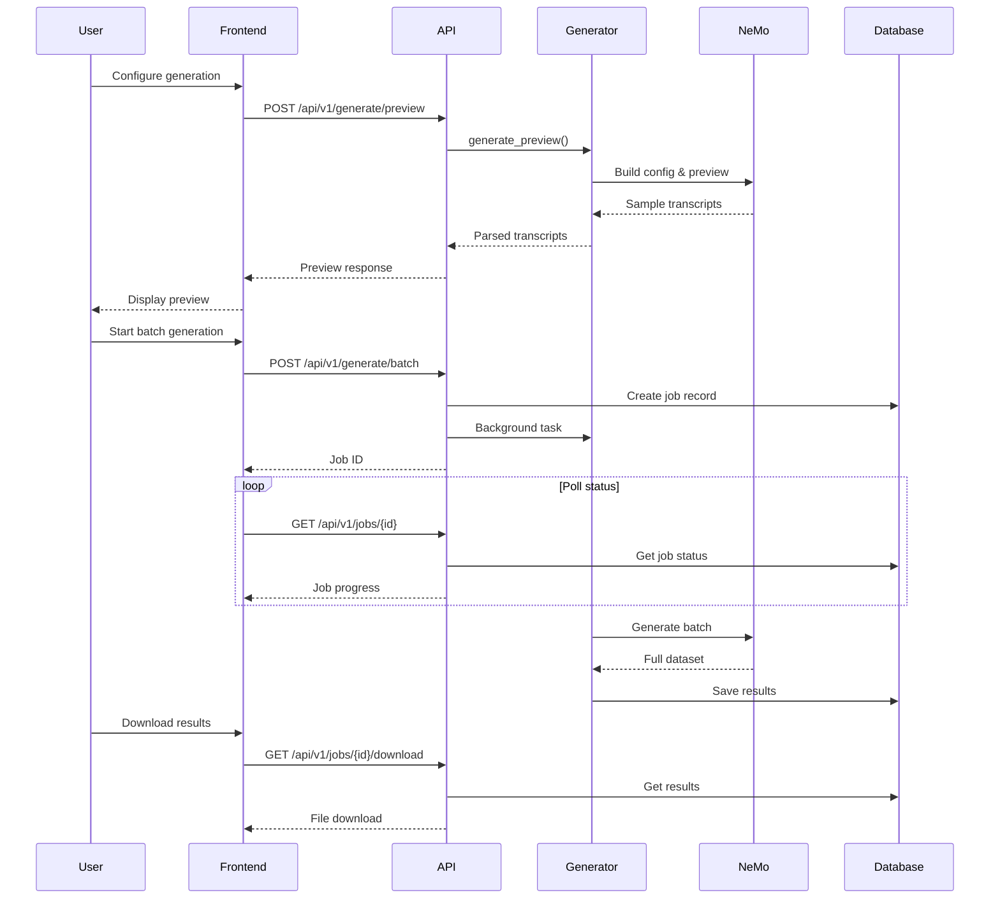
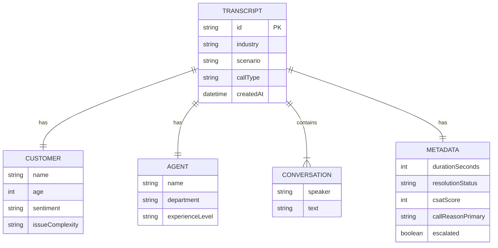
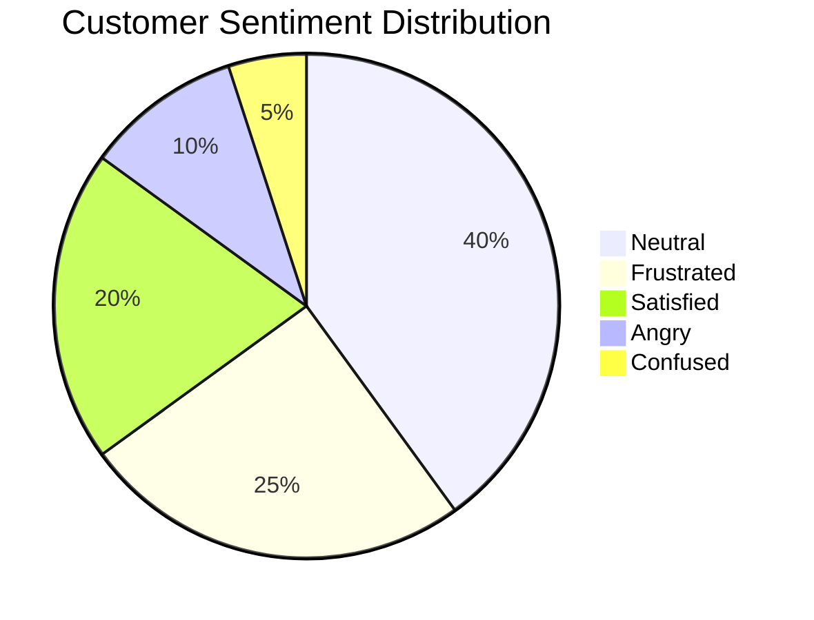
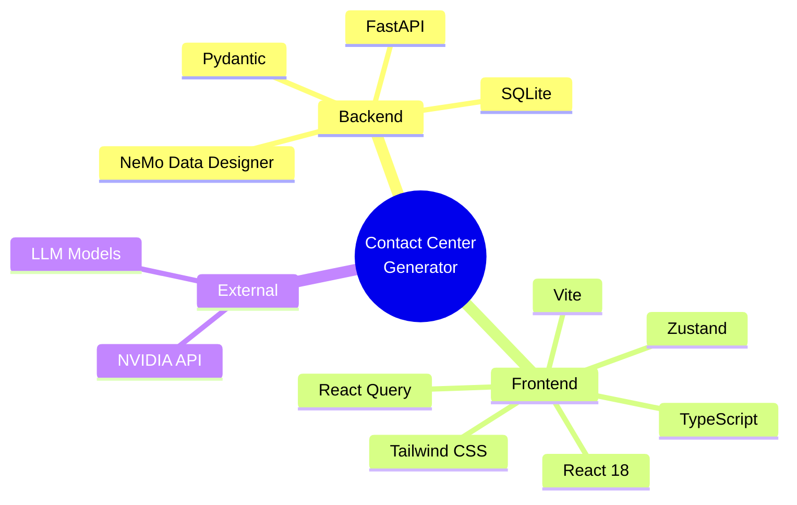

# 📞 Contact Center Transcript Generator

Generate realistic synthetic contact center transcripts using NVIDIA NeMo Data Designer. Perfect for training AI models, testing contact center analytics, and developing customer service applications.


## 🌐 Live Demo

> **Try it now!** The application is deployed on Google Cloud Run:
>
> - **Frontend:** [https://nv-data-generator-frontend-c2lqvh37bq-uc.a.run.app](https://nv-data-generator-frontend-c2lqvh37bq-uc.a.run.app)
> - **Backend API:** [https://nv-data-generator-backend-c2lqvh37bq-uc.a.run.app](https://nv-data-generator-backend-c2lqvh37bq-uc.a.run.app)
> - **API Docs:** [https://nv-data-generator-backend-c2lqvh37bq-uc.a.run.app/docs](https://nv-data-generator-backend-c2lqvh37bq-uc.a.run.app/docs)


## 🎯 Overview

This application provides a web-based interface for generating high-quality synthetic contact center transcripts across multiple industries. It leverages NVIDIA's NeMo Data Designer to create realistic customer-agent conversations with configurable parameters.

### Key Features

- 🏭 **6 Industry Templates** - Healthcare, Finance, Retail, Telecom, Insurance, Travel
- 🎭 **30+ Scenarios** - Industry-specific call scenarios with domain terminology
- 🎚️ **Configurable Parameters** - Sentiments, call types, conversation length, complexity
- 📊 **Multiple Export Formats** - JSON, JSONL, CSV
- 🔄 **Background Processing** - Async job queue with progress tracking
- 💾 **Persistent Storage** - SQLite-based job history

## 🏗️ Architecture



## 📁 Project Structure

```
├── backend/
│   ├── app/
│   │   ├── main.py              # FastAPI application entry
│   │   ├── config.py            # Configuration settings
│   │   ├── models/              # Pydantic data models
│   │   │   ├── job.py           # Generation job model
│   │   │   └── transcript.py    # Transcript & config models
│   │   ├── routers/             # API endpoints
│   │   │   ├── generate.py      # Generation endpoints
│   │   │   ├── jobs.py          # Job management
│   │   │   └── industries.py    # Industry data
│   │   ├── services/            # Business logic
│   │   │   ├── transcript_generator.py
│   │   │   └── job_store.py
│   │   └── templates/           # Industry templates
│   │       └── industries/
│   ├── pyproject.toml
│   └── jobs.db                  # SQLite database
├── frontend/
│   ├── src/
│   │   ├── components/          # React components
│   │   ├── stores/              # Zustand state management
│   │   ├── services/            # API client
│   │   └── data/                # Static data
│   ├── package.json
│   └── vite.config.ts
└── DataDesigner/                # NeMo Data Designer library
```

## 🔄 Data Flow



## 🏭 Supported Industries

| Industry | Icon | Scenarios |
|----------|------|-----------|
| Healthcare | 🏥 | Appointment Scheduling, Insurance Claims, Prescription Refills, Billing, Medical Info |
| Finance & Banking | 🏦 | Account Inquiry, Fraud Alert, Loan Application, Card Dispute, Wire Transfer |
| Retail & E-commerce | 🛒 | Order Status, Returns & Refunds, Product Inquiry, Complaints, Loyalty Program |
| Telecommunications | 📱 | Service Outage, Plan Changes, Billing Issues, Tech Support, New Activation |
| Insurance | 🛡️ | Claims Filing, Policy Inquiry, Coverage Questions, Premium Payments, Renewal |
| Travel & Hospitality | ✈️ | Reservations, Cancellations, Complaints, Loyalty Rewards, Special Requests |

## 📊 Generated Transcript Schema



## 🚀 Getting Started

### Prerequisites

- Python 3.10+
- Node.js 18+
- NVIDIA API Key (from [build.nvidia.com](https://build.nvidia.com))

### Backend Setup

```bash
# Navigate to backend
cd backend

# Create virtual environment
python -m venv venv
source venv/bin/activate  # On Windows: venv\Scripts\activate

# Install dependencies
pip install -e .

# Configure environment
cp .env.example .env
# Edit .env and add your NVIDIA_API_KEY

# Start the server
uvicorn app.main:app --reload --port 8000
```

### Frontend Setup

```bash
# Navigate to frontend
cd frontend

# Install dependencies
npm install

# Configure environment
cp .env.example .env

# Start development server
npm run dev
```

### Access the Application

- Frontend: http://localhost:5173
- Backend API: http://localhost:8000
- API Documentation: http://localhost:8000/docs

## 🔧 Configuration Options

### Generation Parameters

| Parameter | Type | Default | Description |
|-----------|------|---------|-------------|
| `industry` | string | - | Target industry for transcripts |
| `scenarios` | string[] | all | Specific scenarios to generate |
| `callTypes` | string[] | ["inbound"] | Call direction types |
| `sentiments` | string[] | ["neutral", "frustrated", "satisfied"] | Customer sentiment distribution |
| `numRecords` | int | 10 | Number of transcripts (1-1000) |
| `minTurns` | int | 4 | Minimum conversation turns |
| `maxTurns` | int | 12 | Maximum conversation turns |

### Customer Sentiments



## 📡 API Endpoints

### Generation

| Method | Endpoint | Description |
|--------|----------|-------------|
| POST | `/api/v1/generate/preview` | Generate preview (1-5 records) |
| POST | `/api/v1/generate/batch` | Start batch generation job |

### Jobs

| Method | Endpoint | Description |
|--------|----------|-------------|
| GET | `/api/v1/jobs` | List all jobs |
| GET | `/api/v1/jobs/{id}` | Get job status |
| GET | `/api/v1/jobs/{id}/download` | Download results |
| DELETE | `/api/v1/jobs/{id}` | Delete job |

### Industries

| Method | Endpoint | Description |
|--------|----------|-------------|
| GET | `/api/v1/industries` | List all industries |
| GET | `/api/v1/industries/{id}/scenarios` | Get industry scenarios |

## 📤 Export Formats

### JSON
Full structured data with nested objects, ideal for programmatic processing.

### JSONL (JSON Lines)
One transcript per line, perfect for streaming and large datasets.

### CSV
Flattened format with key fields, suitable for spreadsheet analysis.

## 🔌 Technology Stack



## 🧪 Sample Output

```json
{
  "id": "tx-a1b2c3d4",
  "industry": "healthcare",
  "scenario": "appointment",
  "callType": "inbound",
  "customer": {
    "name": "Sarah Johnson",
    "age": 42,
    "sentiment": "neutral",
    "issueComplexity": "low"
  },
  "agent": {
    "name": "Emily Wilson",
    "department": "Customer Service",
    "experienceLevel": "mid"
  },
  "conversation": [
    {"speaker": "agent", "text": "Thank you for calling HealthCare Plus. This is Emily. How may I assist you today?"},
    {"speaker": "customer", "text": "Hi, I'd like to schedule an appointment with Dr. Smith."},
    {"speaker": "agent", "text": "I'd be happy to help you with that. Let me check Dr. Smith's availability..."}
  ],
  "metadata": {
    "durationSeconds": 245,
    "resolutionStatus": "resolved",
    "csatScore": 5,
    "callReasonPrimary": "Appointment Scheduling",
    "escalated": false
  },
  "createdAt": "2025-12-20T10:30:00Z"
}
```

## 🛠️ Development

### Running Tests

```bash
# Backend tests
cd backend
pytest

# Frontend tests
cd frontend
npm test
```

### Building for Production

```bash
# Frontend build
cd frontend
npm run build

# Backend - use production ASGI server
uvicorn app.main:app --host 0.0.0.0 --port 8000
```

## 📝 Environment Variables

| Variable | Required | Description |
|----------|----------|-------------|
| `NVIDIA_API_KEY` | Yes | API key from build.nvidia.com |
| `ARTIFACT_PATH` | No | Path for generated artifacts (default: ./artifacts) |

## 🤝 Contributing

1. Fork the repository
2. Create a feature branch (`git checkout -b feature/amazing-feature`)
3. Commit your changes (`git commit -m 'Add amazing feature'`)
4. Push to the branch (`git push origin feature/amazing-feature`)
5. Open a Pull Request

## 📄 License

This project is licensed under the MIT License - see the [LICENSE](LICENSE) file for details.

## 🙏 Acknowledgments

- [NVIDIA NeMo Data Designer](https://github.com/NVIDIA-NeMo/DataDesigner) - Synthetic data generation framework
- [FastAPI](https://fastapi.tiangolo.com/) - Modern Python web framework
- [React](https://react.dev/) - UI library
- [Tailwind CSS](https://tailwindcss.com/) - Utility-first CSS framework
